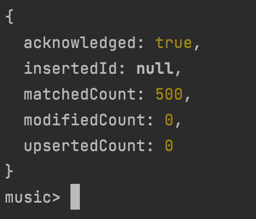

# Ejercicio 1 - Mongodb

1. [Instrucciones](#instrucciones)
    - [Paso 1: Movimientos previos](#paso-1-movimientos-previos)
    - [Paso 2: Descargar la imagen de MongoDB](#paso-2-descargar-la-imagen-de-mongodb)
    - [Paso 3: Levantar el contenedor](#paso-3-levantar-el-contenedor)
2. [Ejercicios](#ejercicios)
    - [Ejercicio 1.a](#ejercicio-1a)
    - [Ejercicio 1.b](#ejercicio-1b)
    - [Ejercicio 1.c](#ejercicio-1c)
    - [Ejercicio 1.d](#ejercicio-1d)

## Instrucciones

### Paso 1: Movimientos previos

Asegurarse de estar parado sobre el directorio correspondiente al ejercicio `/mongodb`

### Paso 2: Descargar la imagen de MongoDB
Utiliza el siguiente comando para descargar la imagen oficial de MongoDB:
```bash
docker pull mongo
```

### Paso 3: Levantar el contenedor
```bash
docker run --name Mymongo -p 27017:27017 -d mongo
```


## Ejercicios

### Ejercicio 1.a
***Importe el archivo albumlist.csv (o su versión RAW) a una colección. 
Este archivo cuenta con el top 500 de álbumes musicales de todos los tiempos según la revista Rolling Stones.***

Copiar el archivo CSV al contenedor

```bash
docker cp ./resources/albumlist.csv Mymongo:/home/
```
Ejecutar el comando de importación dentro del contenedor

```bash
docker exec -it Mymongo mongoimport --db music --collection albums --type csv --file /home/albumlist.csv --headerline
```

***

Para correr cada consulta, primero se deben correr los siguientes comandos:

```bash
docker exec -it Mymongo bash ##Levanta un Shell bash dentro del contenedor
```
```bash
mongosh ##Ejecuta el Shell de MongoDB
```
```bash
use music ##Para usar la base de datos 'music'
```
***
### Ejercicio 1.b
***Cuente la cantidad de álbumes por año y ordénelos de manera descendente (mostrando los años con mayor cantidad de álbumes al principio).***

Dentro de la shell de MongoDB ejecutar la consulta:
```bash
db.albums.aggregate([
  {
    $group: {
      _id: "$Year",
      album_amount: { $sum: 1 }
    }
  },
  {
    $sort: {
      album_amount: -1
    }
  },
  {
    $project: {
      _id: 0,
      year: "$_id",
      album_amount: 1
    }
  }
]);
```

La salida en la terminal debería verse así:


***

### Ejercicio 1.c
***A cada documento, agregarle un nuevo atributo llamado 'score' que sea 501- Number.***

Dentro de la shell de MongoDB ejecutar la consulta:
```bash
db.albums.updateMany(
  {},
  [{ $set: { score: { $subtract: [501, "$Number"] } } }]
);
```

La salida en la terminal debería verse así:



***
### Ejercicio 1.d
***Realice una consulta que muestre el 'score' de cada artista.***


Dentro de la shell de MongoDB ejecutar la consulta:
```bash
db.albums.aggregate([
  {
    $group: {
      _id: "$Artist",
      score: { $sum: "$score" }
    }
  },
  {
    $project: {
      _id: 0,
      Artist: "$_id",
      score: 1
    }
  }
]);
```
La salida en la terminal debería verse así:


