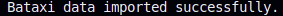

# Índice

1. [Ejercicio 3 - Redis](#ejercicio-3---redis)
    - [Paso 1: Movimientos previos](#paso-1-movimientos-previos)
    - [Paso 2: Descargar la imagen de Redis](#paso-2-descargar-la-imagen-de-redis)
    - [Paso 3: Levantar el contenedor](#paso-3-levantar-el-contenedor)
2. [Ejercicio 3.a: Importar los datos del archivo a Redis](#ejercicio-3a-importar-los-datos-del-archivo-a-redis)
3. [Ejercicio 3.b, 3.c, 3.d: Consultas y Comandos](#ejercicio-3b-3c-3d-consultas-y-comandos)
4. [Ejercicio 3.d: Estructura de Redis sobre la que trabaja el GeoADD](#ejercicio-3d-estructura-de-redis-sobre-la-que-trabaja-el-geoadd)


# Ejercicio 3 - Redis

### Paso 1: Movimientos previos

Asegurarse de estar parado sobre el directorio correspondiente al ejercicio `/redis`

### Paso 2: Descargar la imagen de Redis
Utilizar el siguiente comando para descargar la imagen oficial de Redis:
```bash
docker pull redis
```

### Paso 3: Levantar el contenedor
```bash
docker run --name Myredis -p 6379:6379 -d redis
```

## Ejercicio 3.a
***Importar los datos del archivo a Redis***

Se decidió importar el archivo vía python, ya que es un lenguaje de frecuente uso con redis y dado que la [documentación de redis](https://redis.io/docs/latest/develop/data-types/geospatial/) muestra también ejemplos con python. A su vez resulta una buena herramienta ya que en la mayoria de las aplicaciones que podrían usar redis es altamente probablemente que se realize a través la librería específica.

Para eso se deben tener instaladas las librerías `pandas` y `redis`. 

> [!Note]
> Codespace tiene instalado pandas y python3 por default, aun así es una buena práctica verificarlo.

```sh
pip3 install pandas redis
```

Luego, para ejecutar el script que importará los datos al contenedor

```sh
python3 import_data.py
```

Cuando se termine de ejecutar se esparará ver la salida:




***
## Ejercicio 3.b, 3.c, 3.d
El archivo de python `query_data.py` contiene los comandos automatizados para ejectuar las consultas particulares de los ejercicios
```sh
python3 query_data.py
```
La salida esperada es:

```
b. Total de viajes a 1 km de los 3 lugares: 590
-- Total de viajes a 1 km de Parque Chas: 339
-- Total de viajes a 1 km de UTN: 9
-- Total de viajes a 1 km de ITBA Madero: 242

c. Total de KEYS en la base de datos: 1

d. Total de miembros en la key 'bataxi': 19148
```

Este script ejecutará los comandos en el cli de redis dentro del contenedor de docker levantado.

> [!Note]
> De forma equivalente, lo que hace python es ejecutar los comandos en el cli de redis de esta forma
>
> #### Ejercicio b
> ```sh
> # Cuenta la cantidad de ubicaciones a 1km de Parque Chas
> GEORADIUS bataxi -58.479258 -34.582497 1 km
> 
> # Cuenta la cantidad de ubicaciones a 1km de UTN
> GEORADIUS bataxi -58.468606 -34.658304 1 km
> 
> # Cuenta la cantidad de ubicaciones a 1km de Madero
> GEORADIUS bataxi -58.367862 -34.602938 1 km
> ```
> donde luego utiliza la suma para obtener el total
>
> #### Ejercicio c
> ```sh
> # Cantidad de keys en la base de datos
> DBSIZE
> ```
>
> #### Ejercicio d
> ```sh
> # Cantidad de miembros de 'bataxi'
> ZCARD bataxi
> ```


***
## Ejercicio 3.d
***¿Sobre qué estructura de Redis trabaja el GeoADD?***

El comando `GEOADD` trabaja sobre la estructura de datos `Sorted Set`(Se puede ver que para el ejercicio anterior se usó `ZCARD` para obtener la cardinalidad de un conjunto ordenado), donde las coordenadas son almacenadas como elementos del set con la puntuación correspondiente a las coordenadas geohash.


> The way the sorted set is populated is using a technique called [Geohash](https://en.wikipedia.org/wiki/Geohash). Latitude and Longitude bits are interleaved to form a unique 52-bit integer. We know that a sorted set double score can represent a 52-bit integer without losing precision.
> This format allows for bounding box and radius querying by checking the 1+8 areas needed to cover the whole shape and discarding elements outside it. The areas are checked by calculating the range of the box covered, removing enough bits from the less significant part of the sorted set score, and computing the score range to query in the sorted set for each area.
> 
> - [Documentación de GEOADD](https://redis.io/docs/latest/commands/geoadd/)
